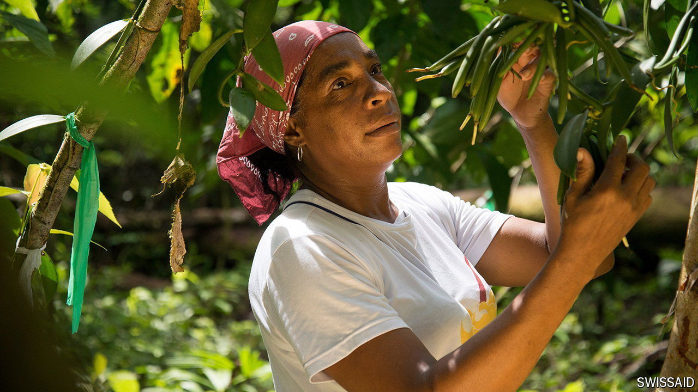

###### Perfume of the Pacific

# Colombia prepares for a vanilla boom 

##### Purveyors of scented products and posh ice-creams take note 

 

> Aug 8th 2024 

Vanilla is “a product of time and patience”, says Cristian Garcia Murillo. In 2016 his father trained vines around cacao trees on their farm in El Valle, a town on Colombia’s Pacific coast. Last year Mr Murillo sold 50kg of cured pods, partly supplied by local growers, to restaurants across the country. It is a sweet deal. One kilogram fetches up to 2.5m pesos ($600), more than 100 times what the region’s fishermen net for the same weight of tuna.

