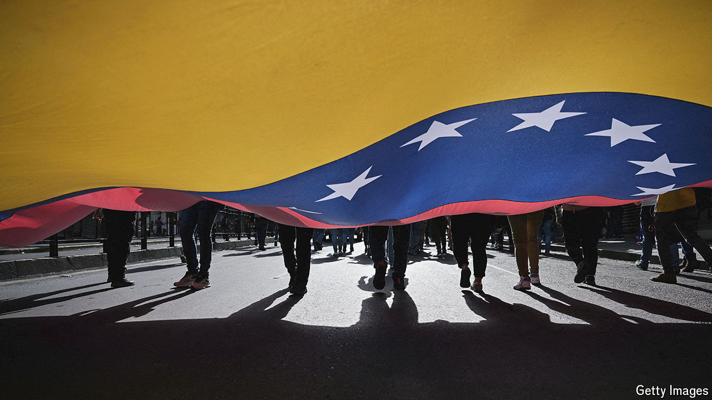

###### Venezuela’s election

# How the mad, bad Maduro regime clings to power 

##### Behind-the-scenes negotiations seek to ease him out of office 

 

> Aug 6th 2024 

For a man who supposedly won an election, Venezuela’s president, , looks worried. The gaudy tracksuit he sported during much of the campaign has been swapped for a solemn business suit. He seems irritable and exhausted in the repeated television rants in which he rails against “fascist” enemies. Days after a rigged election, it remains unclear whether he can remain in power. 

