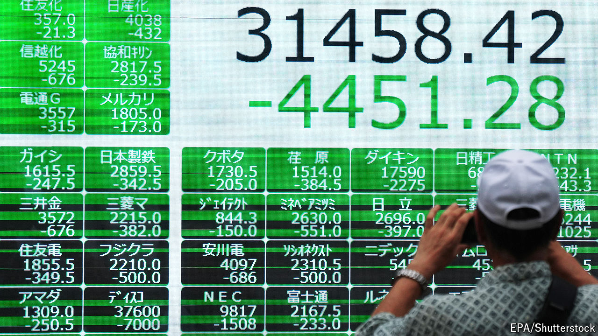

###### The world this week

# Business 

#####  

 

> Aug 8th 2024 

Global  had a rollercoaster week, underlined by the VIX index of volatility reaching its highest level since the start of the covid-19 pandemic. The S&amp;P 500 fell sharply and the NASDAQ Composite entered correction territory in a rout triggered by news that job creation in America had slowed substantially in July, raising fears of a recession. Both market indices clawed back some of their losses in subsequent sessions. 

