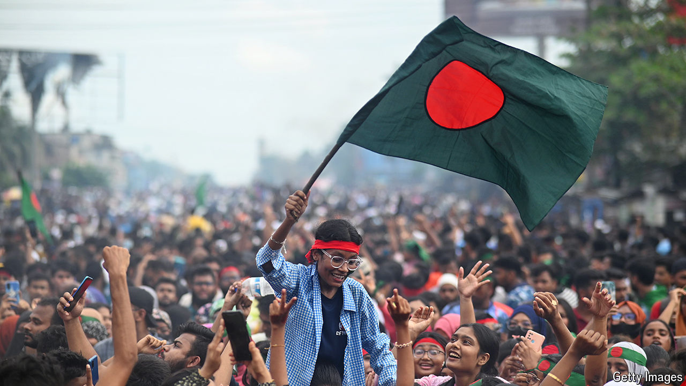

###### The world this week

# Politics 

#####  

 

> Aug 8th 2024 

Sheikh Hasina was ousted as prime minister of  and fled the country, following weeks of mass protests led by students. Hundreds of people were killed by the security forces in a crackdown on the demonstrators. Sheikh Hasina had ruled Bangladesh for 20 of the past 28 years with an iron fist. The recently appointed head of the army described the uprising as a “revolutionary period”. Khaleda Zia, a former prime minister and leader of the opposition, was freed from house arrest after the dictator fled. Muhammad Yunus, a Nobel peace prizewinner, was named interim leader. 

