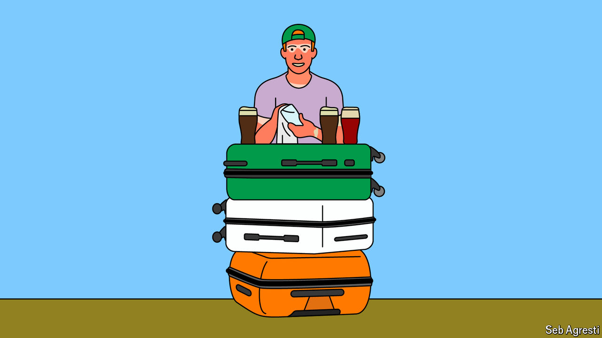

###### The Irish hello

# A short-term work visa shows the benefits of immigration 

##### America’s J1 visa programme shows how open borders can build cultural links 

 

> Aug 8th 2024 

In popular imagination, it is around St Patrick’s Day that Chicago reaches peak Irish. Each year, on the Saturday before March 17th, the city’s plumbers union dyes the river green and thousands of people flock downtown to swig pints of green beer. In a more real sense, though, Chicago is probably at its most Irish on a Saturday somewhere in early July. That is when the J1 visa-holders are in town. 

