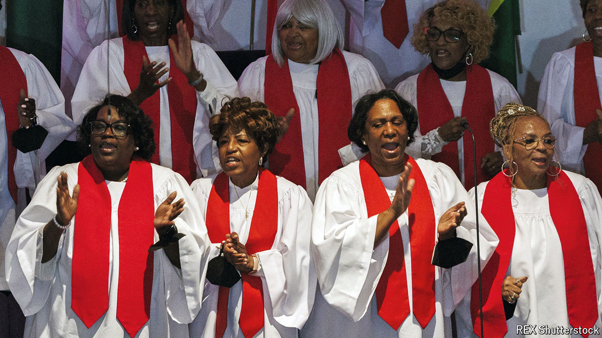

###### Yes in God’s backyard

# Can churches fix America’s affordable-housing crunch? 

##### The promise of the YIGBY movement 

 

> Aug 8th 2024 

The puritans who founded America’s divinity schools could not have imagined that they might need a course on property negotiation. But these days, in addition to counselling the dying and giving sermons on Sundays, some pastors are at the forefront of a new housing project. Churches across the country are working with non-profit groups to convert their under-used land into affordable flats. Riffing off the anti-development slogan “Not in my backyard” (NIMBY), they are advocating something cheerier: “Yes in God’s backyard” (YIGBY).

