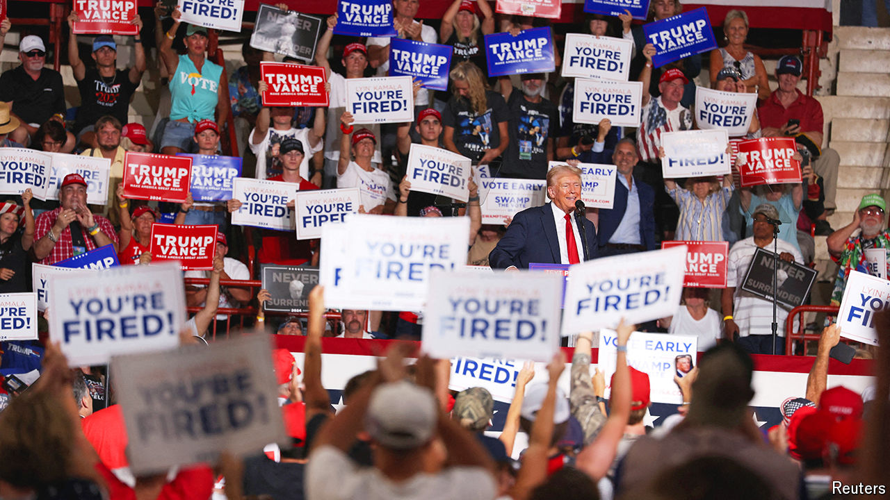

###### Turning pro

# How the Trump campaign has become more professional 

##### In Pennsylvania at least, it has upped its ground game 

 

> Aug 8th 2024 

Standing outside a quaint house in the Philadelphia suburbs of Delaware County, Dawn Stensland sounds like an agony aunt. “I was a closet conservative, like maybe some of you,” she claims to a crowd. “It’s time to come out of the closet and wear your Trump hat.” The house expresses this advice: the windows are plastered with posters advertising it as the local Trump Force 47 office, Donald Trump’s get-out-the-vote operation for 2024. During his previous presidential runs, Mr Trump took a haphazard approach to his ground game. This time, in Pennsylvania at least, his effort looks more formidable.

