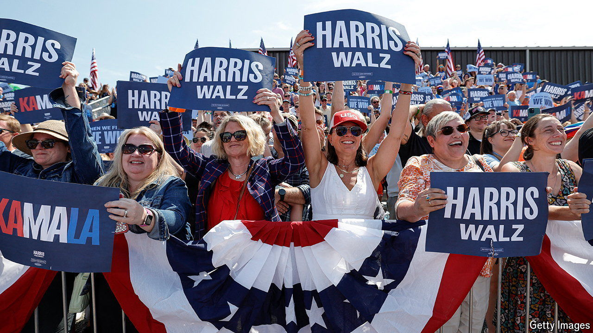

###### Head to head

# Kamala Harris leads Donald Trump in our nationwide poll tracker 

##### It is the first lead for a Democratic contender since October 2023 

 

> Aug 5th 2024 

THERE ARE no “quick fixes” in election campaigns.  into the presidential election puts this conventional wisdom to the test. In two weeks as the Democratic Party’s presumptive nominee, the vice-president has broken fundraising records and enthused the Democratic base. Her rise to the nomination has been smooth, although Republican attacks on her have barely begun. Now, with enough polling to see the effect of her candidacy,  has published an . It shows Ms Harris leading her opponent, , by 47% to 45% in the national popular vote. This is the first lead for the likely Democratic candidate since October 2023.

