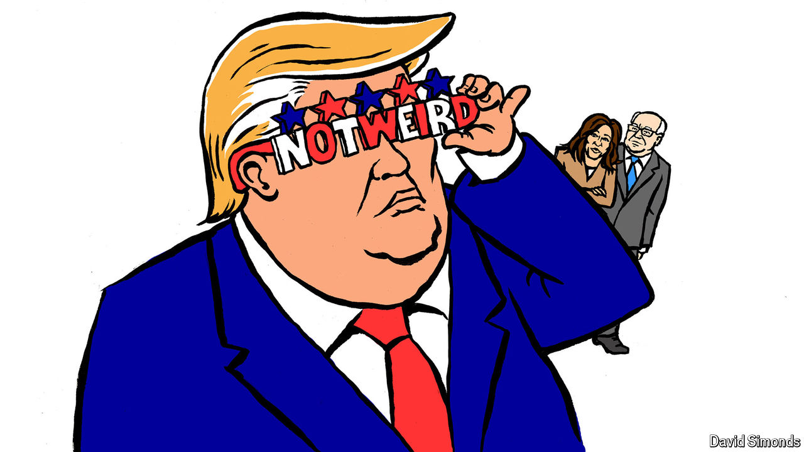

###### Lexington

# The wisdom in calling Donald Trump weird 

##### Kamala Harris and Tim Walz are trying to make Democrats normal again 

 

> Aug 7th 2024 

The bickering among Democrats and Republicans over which party’s nominee is weirder is among the more hopeful developments of this presidential campaign. It implicitly brings to the forefront of politics the question: what is normal? President Joe Biden’s bid to be re-elected at the age of 81 was obviously not that.  knew it all along, even as Democratic leaders, while secretly sharing the opinion, laboured to insist otherwise. The exultation within the party over what should be quite normal—having a candidate who campaigns vigorously, speaks clearly and laughs easily—is an index of how strange Mr Biden’s wan, creaky candidacy had become. 

