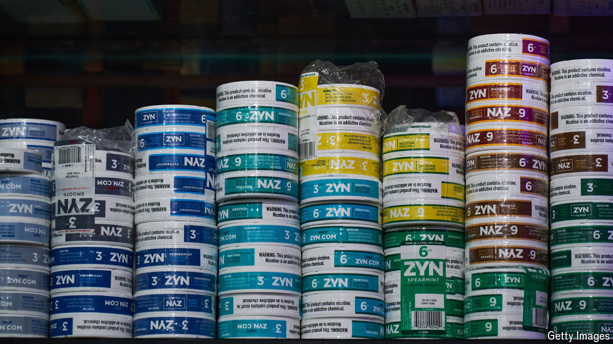

###### Pouches of resistance

# Why do conservatives in America love Zyn? 

##### A nicotine pouch has stimulated America’s young men—and the culture wars 

 

> Aug 3rd 2024 

You have probably heard of , a former Fox News host. But what about Tucker Carlzyn? Mr Carlson has earned the moniker for his enthusiasm for Zyn, a small white pouch, placed between the lip and the gum, that delivers a jolt of nicotine. He has called it “a powerful work enhancer, and also a male enhancer, if you know what I mean”, and likened its effect to “the hand of God reaching down and massaging your central nervous system”. Thanks in part to Mr Carlson, Zyn has become a symbol for a new boyish blend of conservative masculinity. 

