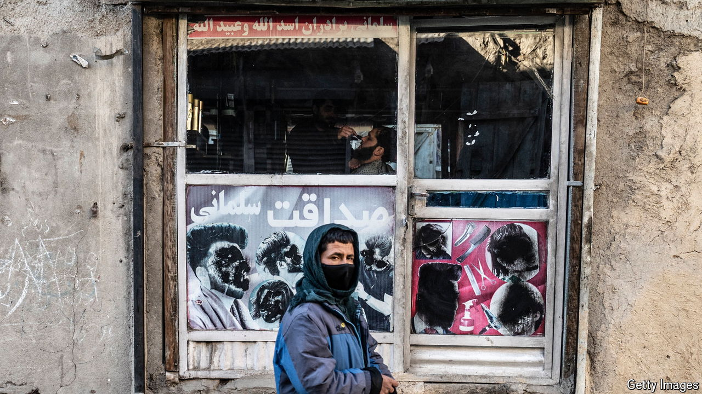

###### The anniversary of the exit from Kabul

# Afghans are suffering. Don’t expect any tears from the Taliban 

##### Three years on from America’s humiliating departure, the country is ignored 

 

> Aug 14th 2024 

THE STREETS of Kabul used to be riotously, almost headache-inducingly colourful. There were billboards advertising Western wear and Punjabi , murals promoting women’s and children’s rights, and everywhere the black-red-green tricolour of the Afghan Republic. Since the Taliban took over three years ago, a monochrome pall has settled on the city. Old posters have been ripped away. Murals have been painted over. The austere flag of the Afghan Emirate dominates, black text on a pure white field. 

