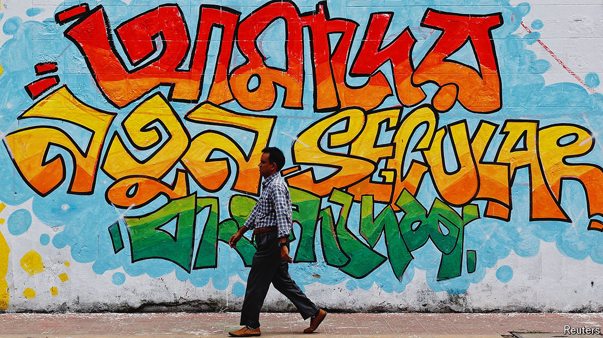

###### The need for speed

# Bangladesh’s new ruler is in a race against time 

##### The country’s police have gone missing 

 

> Aug 14th 2024 

OVER THE past ten days Dhaka, Bangladesh’s capital, has been transformed. Images of Sheikh Hasina, the former prime minister who fled the country on August 5th, and Sheikh Mujibur Rahman, her father and Bangladesh’s founding father, have vanished from billboards. Walls covered in posters and slogans advertising the Awami League (AL), their party, have been painted over with colourful graffiti displaying slogans and scenes from the protests that brought down Sheikh Hasina. “Gen Z cleans the mess”, reads one, “Courage is contagious”, another. The mood has changed along with the appearance of the city. “It’s very freeing to be able to talk openly about things after all these years,” says a young NGO worker.

