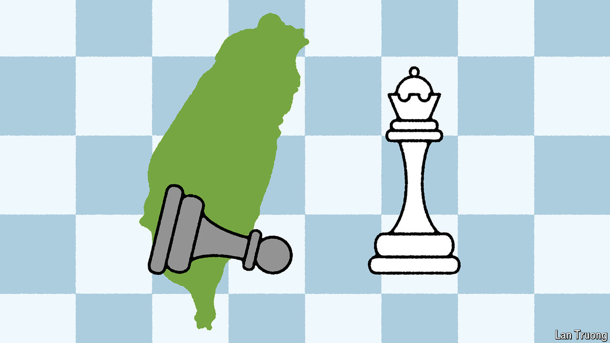

###### Banyan

# Taiwan braces for America’s election 

##### For the opposition, a possible Trump victory is another reason to talk to China 

 

> Aug 15th 2024 

TO THE MEDIA in Taiwan it sounded like a mafia boss demanding protection money. In an interview published in July Donald Trump said that Taiwan “should pay us for defence”. Asked if he would defend it should China invade, the Republican presidential candidate noted that Taiwan is far closer to China than to America. China “could just bombard it…I wouldn’t feel so secure right now, if I was them.” He added that Taiwan “took all of our chip business” and “doesn’t give us anything”.

