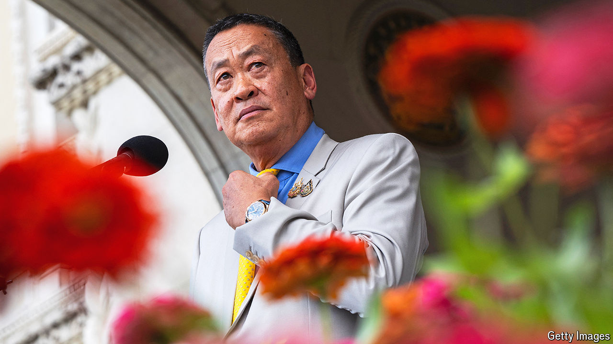

###### Thai politics

# Thailand’s prime minister is sacked. What next? 

##### The constitutional court has further muddied the country’s messy politics 

 

> Aug 15th 2024 

A week after dissolving the party that won the most seats in last year’s parliamentary election, Thailand’s constitutional court has further muddied the country’s messy politics. It removed from office the prime minister, Srettha Thavisin (pictured), ruling that he had violated the constitution with one of his cabinet appointments. Mr Srettha is from Pheu Thai, the party of Thaksin Shinawatra, a former prime minister. It has been ruling in an uneasy coalition of populists and conservatives. Attention now turns to efforts to replace Mr Srettha, and to the next big court hearing on August 19th, on a charge against Mr Thaksin ofa very serious offence in Thailand. ■

