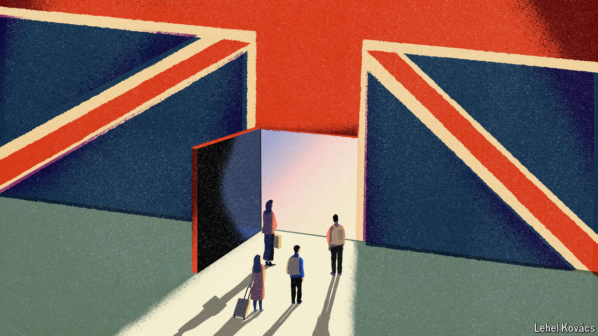

###### Immigration policy

# Britain has many levers for controlling migration. Which ones should it pull? 

##### Not the one marked “reduce the government wage bill” 

 

> Aug 15th 2024 

Labour won power on July 4th after declaring that Britain had too much immigration, and pledging to cut it. The new government promptly ran into the problem that has floored its predecessors. Whatever they may say, ministers have little control over the number of asylum-seekers reaching the country. Those migrants, who are often resented—witness the attacks on hotels used to house them during a wave of racist riots in early August—are driven mostly by wars and geopolitical forces. Nor does the government have much say over the number of arriving Hong Kongers and Ukrainians, to whom it gives special visas. 

