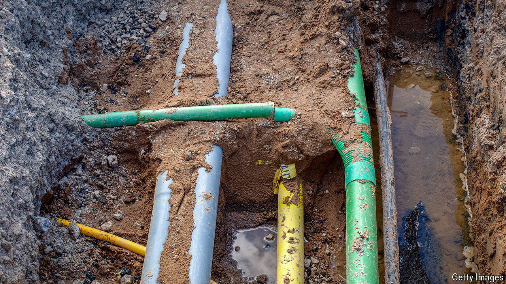

###### Subterranean assets

# Britain’s government is mapping underground cable and pipes 

##### They are at risk from accidental strikes, and malign attacks 

 

> Aug 12th 2024 

Every seven seconds someone in Britain digs a hole. That may sound harmless, but beneath the ground lies some 4m km of cables and pipes—enough to go to the moon and back five times. The problem is that no one knows exactly where they are. That means diggers accidentally sever sunken lines, causing power outages or leaks of gas, water or worse; it also makes it harder to guard against hostile attacks. A new initiative aims to help.

