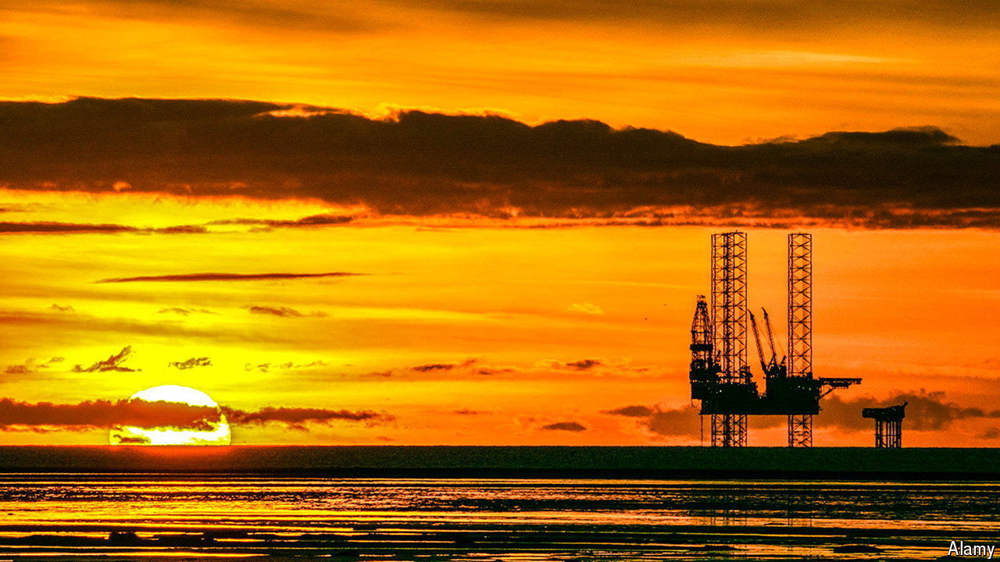

###### Crude realities

# Britain’s oil and gas industry faces an uncertain future 

##### Small operators in the North Sea are struggling with a tax squeeze 

 

> Aug 15th 2024 

The oil and gas industry is a volatile business. Swings in energy prices and the precarious nature of drilling into seabeds are part and parcel of the trade, says David Latin, chairman of Serica Energy, a producer in the North Sea. He once ran oil and gas fields threatened with blockades and militant attacks during a civil war in Libya. He likens the experience to operating in Britain, where a tumultuous tax regime has made it “impossible” to invest.

