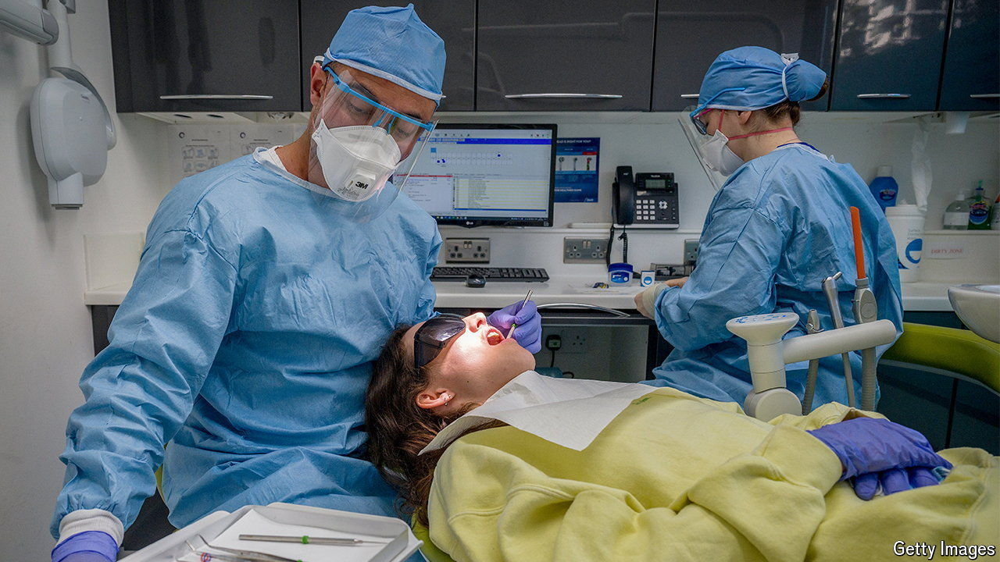

###### Say cheese!

# NHS dentistry is decaying 

##### Can Labour stop the rot? 

 

> Aug 15th 2024 

DENTAID, A BRITISH dental charity, once focused solely on the developing world. For decades, it sent outreach teams to places like Malawi and Uganda. Now they go less often. A crisis in dentistry back home means that the charity has pivoted to drilling teeth outside food banks and community centres across England. Almost all of its work today is in Britain.

