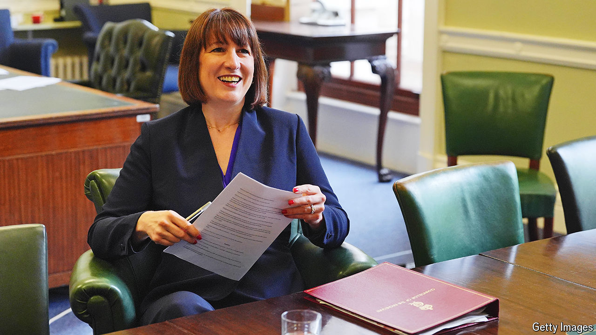

###### A privy counsel

# Winston Churchill’s urinal shows Britain’s hang-up with heritage 

##### A planned Labour reform goes down the drain 

 

> Aug 15th 2024 

Winston Churchill, unusually, underestimated himself. He stated that he had nothing to offer Britain but “blood, toil, tears and sweat”. A spat over a urinal that stands in the Treasury—and that may have been used by the great man himself—shows that, for Britons, other Churchillian fluids are also of abiding interest. 

