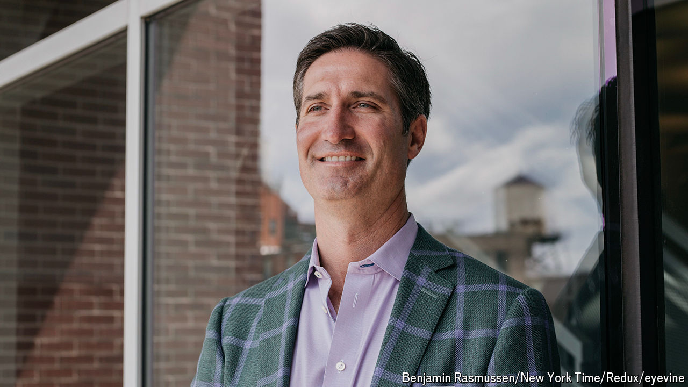

###### Ground down

# Can Chipotle’s boss turn Starbucks around? 

##### Brian Niccol faces three big challenges 

 

> Aug 14th 2024 

Chief executives like to measure their worth in hard currency. One yardstick is their pay. Another is the market’s reaction when they move jobs. Howard Schultz has twice returned to the helm of Starbucks, the  he built up from a handful of trendy shops in Seattle. Shareholders greeted him cautiously both times. But they have given a rapturous welcome to Brian Niccol, the current boss of Chipotle Mexican Grill, a chain of restaurants, who was named Starbucks’ next chief executive and chairman on August 13th. Since then, its market value has risen by $19bn (see chart), adding the equivalent of roughly ten Cheesecake Factories or one Domino’s Pizza.

