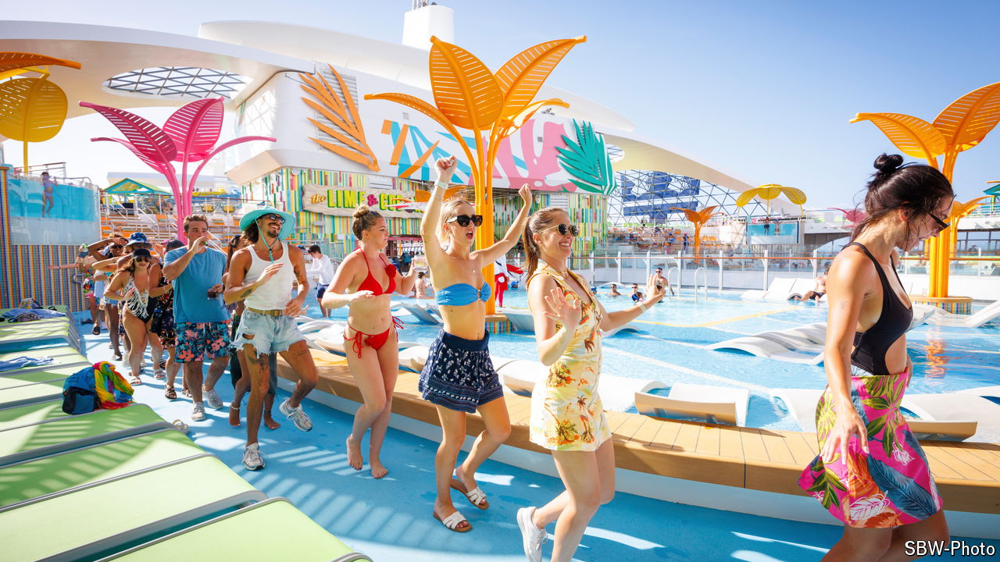

###### Less plain sailing

# From Taylor Swift to Star Trek, niche cruises are on the rise 

##### Themed offerings are luring young and old 

 

> Aug 15th 2024 

Torture, for some, might be spending five nights on a Taylor Swift-themed cruise in the Bahamas. But for Aubreigh Gniotczynski, a 26-year-old from Texas, it is a dream come true. Ms Gniotczynski and her husband—a “fan by marriage”—have each paid more than $1,500 to enjoy karaoke nights and fancy-dress parties on the cruise, which is not affiliated with the star. In preparation, Ms Gniotczynski has been busily making friendship bracelets showcasing Ms Swift’s lyrics, which she will give to her fellow passengers.

