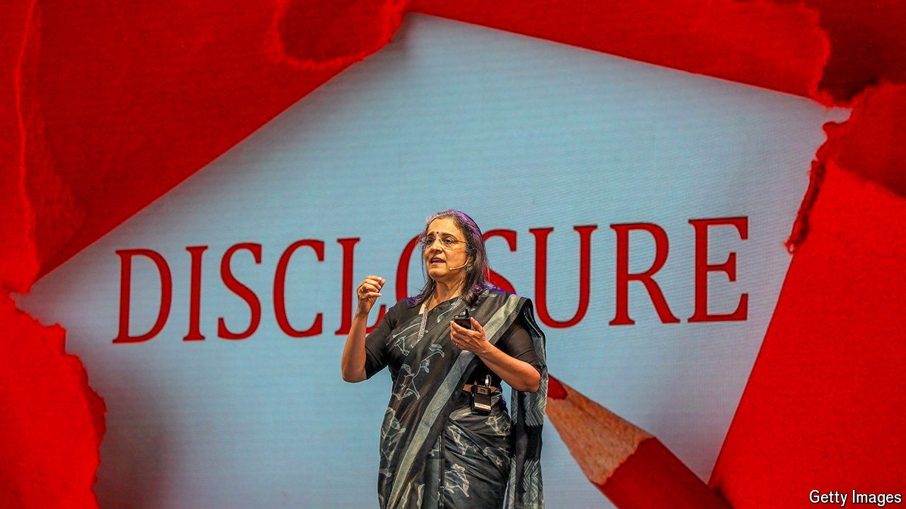

###### Aiming high

# Hindenburg widens its attack on Adani 

##### It has taken aim at the boss of India’s securities regulator 

 

> Aug 15th 2024 

India has never seen a fight quite like this. Late on Saturday August 10th Hindenburg Research, a short-selling firm in New York, posted a follow-up to a report it produced in January last year which described the Adani Group, one of India’s biggest conglomerates, run by one of its richest men, as “the largest con in corporate history”. In its latest broadside Hindenburg alleges that the limited response by the Securities and Exchange Board of India (SEBI) to its first lot of claims is the result of the conflicted interests of its chairwoman, Madhabi Puri Buch. Although opposition politicians in Delhi have called for an investigation and her resignation, Ms Buch seems safe for now. Still, the saga is set to bring lasting improvements to India’s capital markets.

