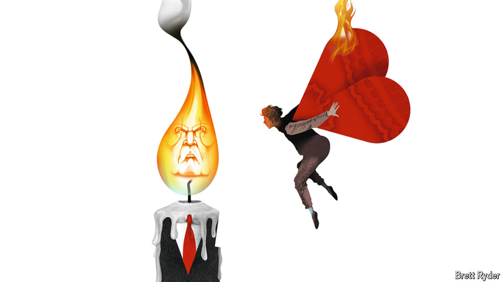

###### Schumpeter

# How bosses should play politics: the cautionary tale of Elon Musk 

##### A new book considers the complex relationship between presidents and company bosses 

 

> Aug 14th 2024 

It is lonely at the top. So lonely, in fact, that sometimes American presidents and titans of industry have only one individual of similar stature to turn to: each other. Over almost two centuries they have played golf together, enjoyed movie nights and told jokes to each other. Some have developed genuine friendships; others have openly hated one another. It is an uneven relationship, of course. Though chief executives tend to stick around longer than presidents, there is no doubt who is higher in the pecking order. But rarely have any mogul’s dealings with presidents past, present and possibly future been as hard to fathom as those of , who once enjoyed the largesse of Barack Obama and is now cheerleader-in-chief for . 

