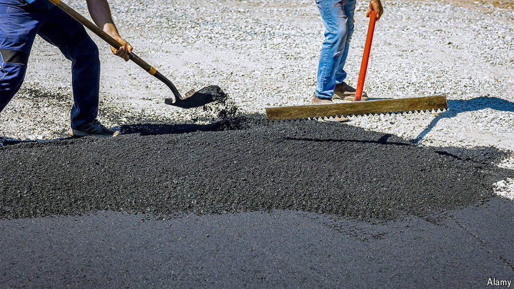

###### Use it or lose it

# Startups are finding novel ways to recycle carbon 

##### Demand is set to rocket as costs continue to fall 

 

> Aug 15th 2024 

In a suburban car park near Seattle Bill Gates recently posed for an unusual photo shoot. Sporting a high-vis jacket and safety boots, the billionaire philanthropist shovelled asphalt from a wheelbarrow into a pothole. Mr Gates was there to tout his investment in a company involved in “carbon utilisation”, a neglected area of climate tech that is heating up.

