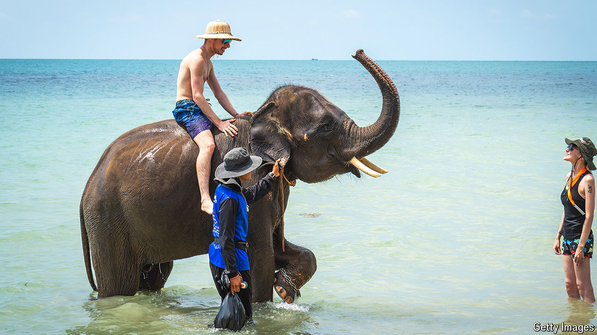

###### Hitting the road

# The global tourism boom is shifting to Asia 

##### Travel in the region is roaring after a difficult few years 

 

> Aug 15th 2024 

Tourism is back, at last. This year the number of trips abroad is expected to overtake levels reached in 2019. Spending by travellers, too, is projected to exceed what was shelled out in 2019, according to the World Travel and Tourism Council (wttc), a trade body. Cruising is . The return of mass tourism has sparked protests in Western hotspots such as Barcelona and Majorca. Talk to a hotelier or a travel agent, though, and the real action is further east. 

