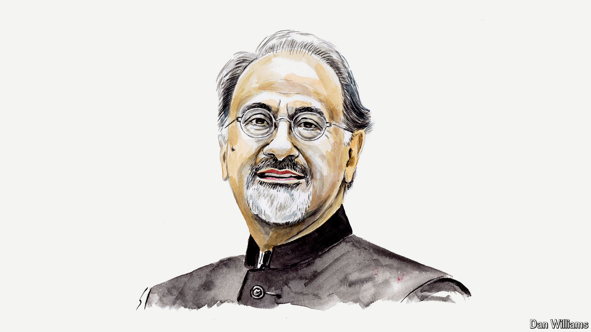

###### Economic development

# Indermit Gill on what China and India must do to join the rich club 

##### First invest, then infuse foreign technology and then innovate, says the World Bank’s chief economist 

 

> Aug 12th 2024 

“TO GET RICH is glorious” is the maxim that inspired one of the most successful development strategies of the past 50 years. It’s an aspiration widely shared across developing countries—and for good reason. When countries become wealthier, the results can be glorious. Living standards rise. Poverty recedes. The propensity to pollute dwindles, as products and production methods improve.

