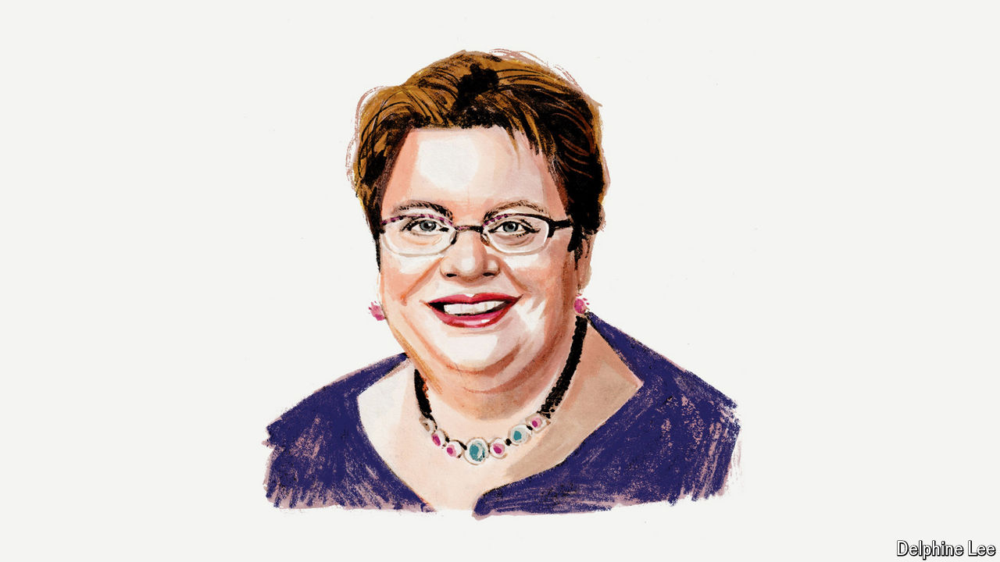

###### American politics

# Kamala Harris must define herself before Donald Trump does it for her 

##### High on her list should be wooing older, less-educated white women, says Celinda Lake, a Democratic pollster 

 

> Aug 15th 2024 

THIS YEAR’S American presidential election has already had its twists and turns, and none has been bigger than President Joe Biden’s decision to drop out. With his withdrawal of his candidacy, the roadmap for a Democratic victory in November—with Vice-President Kamala Harris at the top of the ticket—has been redrawn. When the election was between Mr Biden and Donald Trump, voters thought they already knew both candidates. Now, while voters’ views on Mr Trump are baked in, the race to define Ms Harris is on. She has had a strong start.

