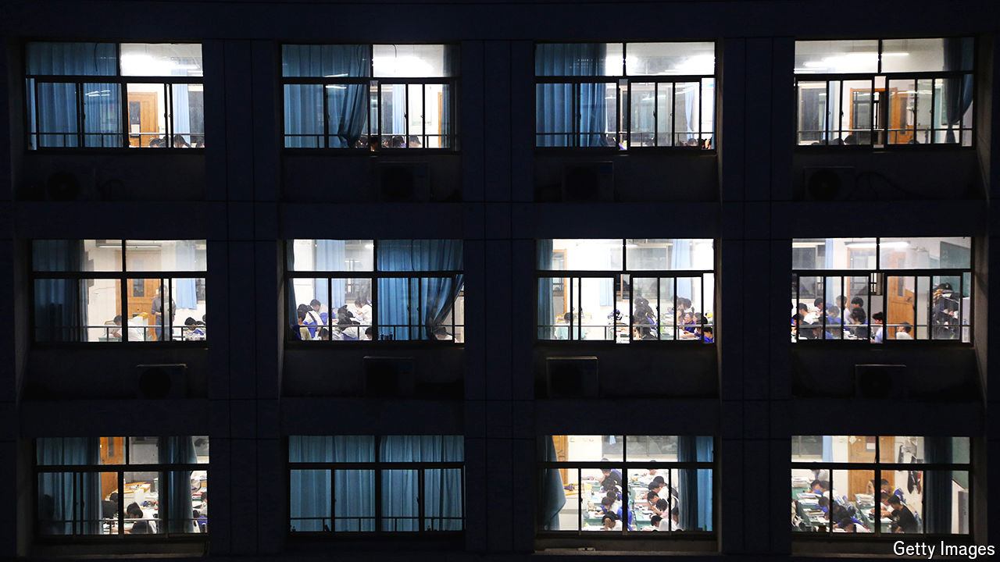

###### Study hard, be rich, get ahead

# China’s wealthy elite rigs its university arms race 

##### Children from poor and rural areas have little hope of keeping up with their rich counterparts 

 

> Aug 15th 2024 

IN CHINA’S TOP-GROSSING summer film, “Successor”, a rich businessman seeks to motivate his son by raising him in poverty. Young Jiye believes his family is truly poor. He is told to “change his fate” by studying hard and doing well in China’s university-entrance exam, known as the . But just in case, his father also hires undercover tutors. Fake street peddlers test Jiye’s English. The neighbourhood butcher gives him maths puzzles. A tutor posing as the family’s grandmother tells the boy that her dying wish is for him to study at an elite university. After her (staged) cremation, a grieving Jiye rushes back to his textbooks. 

