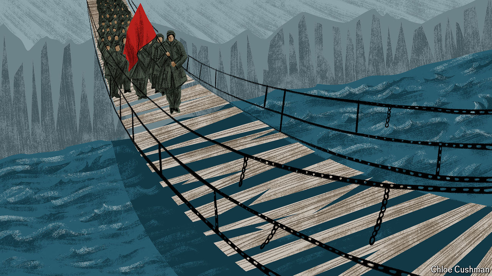

###### Chaguan

# How China thrives in a world of turmoil 

##### The guerrilla tactics of the Long March guide the Communist Party to this day 

 

> Aug 15th 2024 

MODERN CHINA is a superpower with its roots in a guerrilla army. This helps explain its self-interested responses to crises, including the turmoil now raging in the Middle East.

