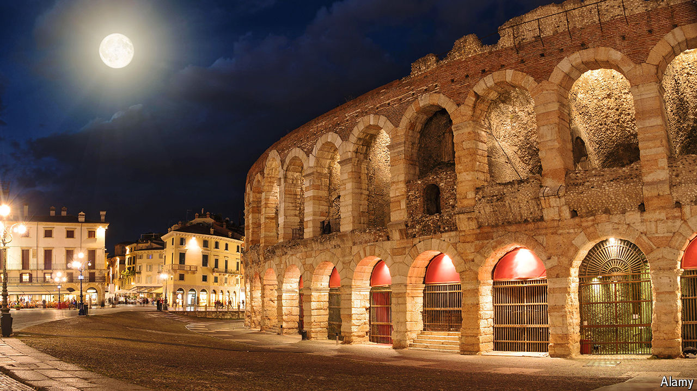

###### Back Story

# On some holidays, beauty and bloodshed are entwined 

##### In grand old cities like Verona, your gelato comes with a moral education 

 

> Aug 9th 2024 

He survived seven bouts in the arena at Verona, but at the age of 23 Glaucus was slain in his eighth. When it was built in 30AD the arena stood outside the Roman city—to keep away the stench of death. Glaucus was one of countless fighters, prisoners and exotic beasts who shed their blood on its sandy floor over centuries of grisly games.

