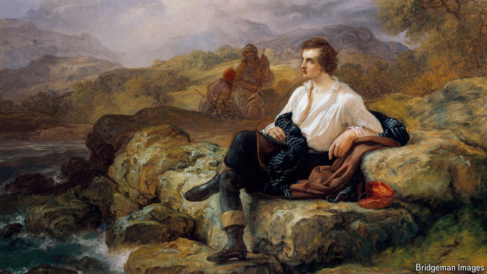

###### Mad, bad and dangerous to know

# Two centuries after his death, why is Lord Byron still seductive? 

##### The poet is celebrated where he spent his period of exile 

 

> Aug 15th 2024 

Even before rumours of his affair with his half-sister spread, Lord Byron had a reputation for scandal. His lover Lady Caroline Lamb famously described him as “mad, bad and dangerous to know”. That did not stop women besotted with his poetry from sending letters, invitations to parties and requests for locks of his hair. “I have been more ravished myself than anybody since the Trojan war,” Byron insisted. 

