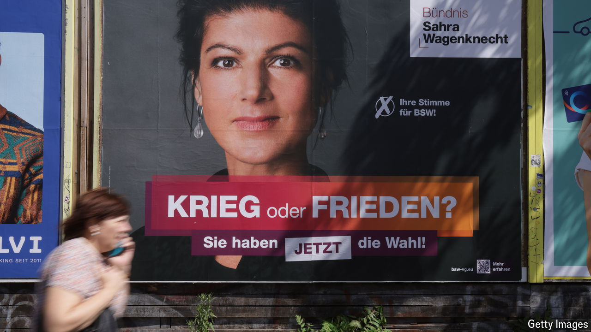

###### Stop the war

# Anti-war parties are set to clean up in eastern German elections 

##### Scepticism about support for Ukraine runs deep in parts of the former communist republic 

 

> Aug 15th 2024 

ANATOLI CALUTCOV, who was born in the Soviet Union, slotted right in when he moved to Dresden 20 years ago. Visiting western parts of Germany always felt a bit strange, he says, but Dresden was like home—perhaps because it used to sit in the communist East German republic (GDR). Business is still brisk in Kalinka, the Russian food shop he runs, even if these days his Russian customers have been largely replaced by Ukrainian refugees.

