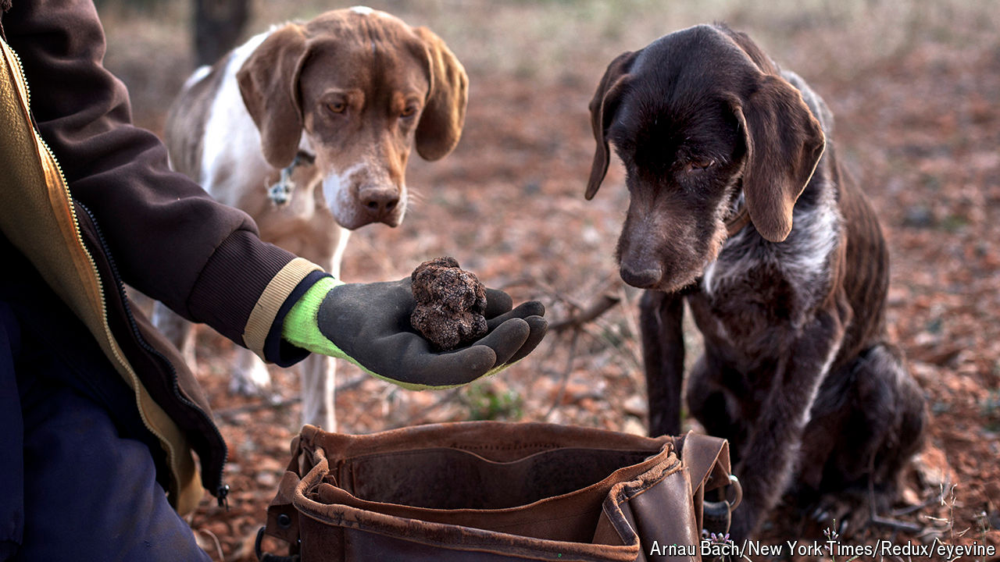

###### The fungus is just starting

# How a Spanish province became the world’s truffle leader 

##### Teruel has replaced France’s Périgord atop the tuber charts 

 

> Aug 15th 2024 

AS A CHILD, Manolo Doñate often saw strange men with dogs in the mountains near his house in Sarrión, a town in the Teruel province of Aragón. They were hunting the abundant wild truffles. In the 1980s, while visiting a plantation in France, he decided to become the first in Teruel to cultivate truffle-producing oak trees. 

