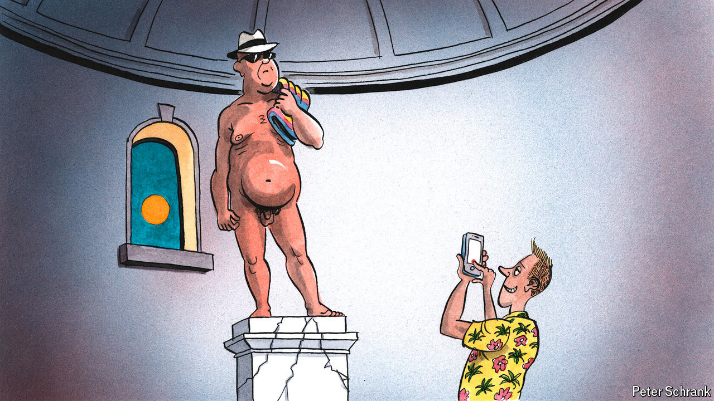

###### Charlemagne

# The great cover-up: Europe is losing its penchant for public nudity 

##### A columnist bares all in pursuit of the naked truth 

 

> Aug 15th 2024 

Man is born naked, but everywhere he is in clothes. Well, nearly everywhere. Visit a sauna in Denmark, bits of public parks in Germany or many a beach in France and clothing becomes as scarce as office workers at the height of August. Mortifying as it may seem to the clothes-minded, Europe is the spiritual home of nudity: a continent where enough people (in some countries more than others) are happy to show off their private parts in public places that it has long since lost the ability to offend. Yet a cloud is hanging over those who eschew bathing costumes. Casual nakedness is falling prey to rising prudishness; nudist associations are losing members at a clip matched only by the church. Worse, a habit one might prefer to be undertaken by the young is increasingly the preserve of the ageing. The sagging clientele for all-nude events points to a more buttoned-up continent. Can Charlemagne strip down the debate to its bare essentials? 

