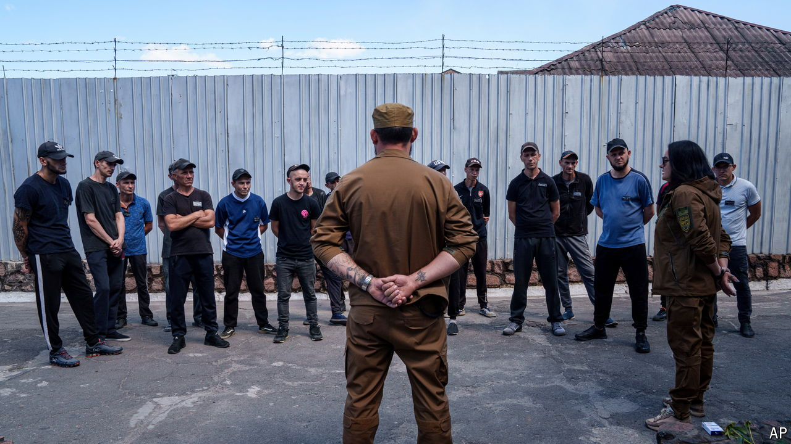

###### Freedom on the line

# Ukraine’s convicts take the fight inside Russia 

##### A hard-bitten major commands a unit of felons—and dreams of kebabs in Moscow 

 

> Aug 15th 2024 

LAUGHTER CUTS through the crunch of gravel as Senior Lieutenant Nazariy Kishak’s jeep arrives. He is four hours late. “It was a shitstorm,” he says, grinning under his crooked boxer’s nose. “A column with 70 Chechens. All with Saint Peter now.” The enemy had been trying to cross the border just north of his unit’s new entry point into Russia.

