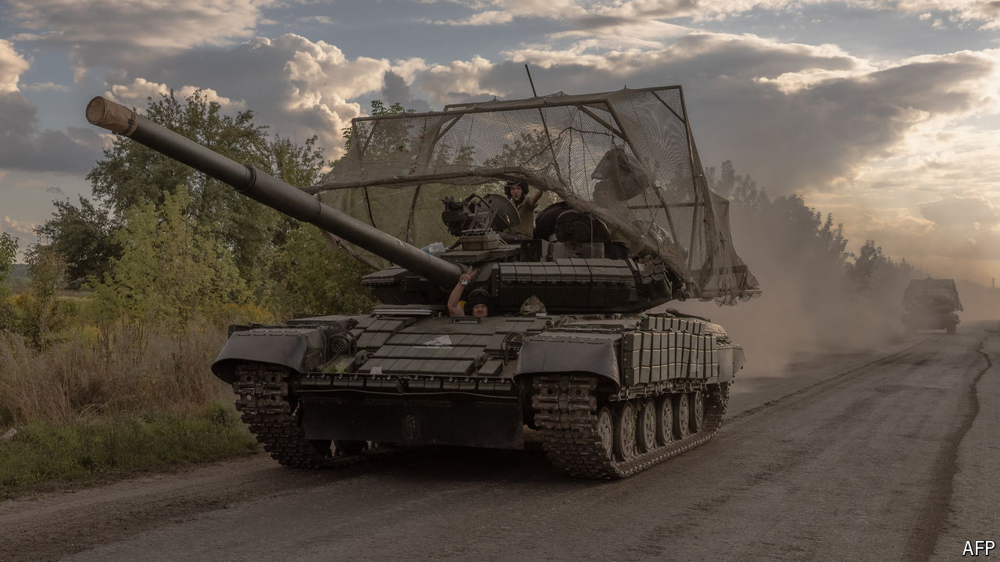

###### Into the breach

# What next after Ukraine’s shock invasion of Russia? 

##### It could dig in, pull back or grab more as a bargaining chip 

 

> Aug 13th 2024 

UKRAINE’S LIGHTNING incursion into the  has exceeded the expectations of even those who planned it. On August 12th General Oleksandr Syrsky, Ukraine’s commander-in-chief, claimed that his forces controlled roughly 1,000 square kilometres of Russian territory. “Control” may be an overstatement. But in seven days the Ukrainians have  almost as much territory as Russia has managed, at huge cost, to take from them since the start of the year (1,175 square kilometres). In the next few days the incursion will probably culminate, as troops tire and supply lines become stretched. The question is whether Ukraine can translate short-term gains into lasting strategic advantage. 

