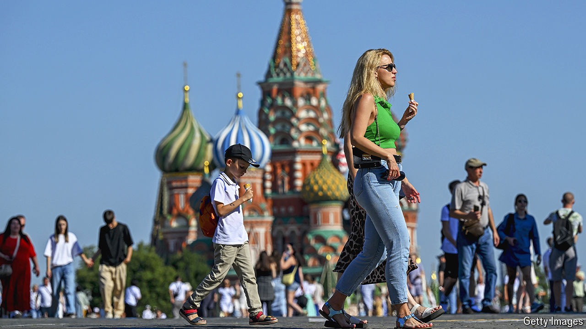

###### War finance

# Vladimir Putin spends big—and sends Russia’s economy soaring 

##### How long can the party last? 

 

> Aug 11th 2024 

AUkrainian incursion into Russia represents an enormous embarrassment for Vladimir Putin and his military leadership. Tens of thousands of residents have been evacuated after Ukrainian troops stormed across the border. The Russian armed forces, caught off guard, are being slow to respond. The rouble is slumping, as worries mount about the future of the war. Yet on the home front, at least, things look better than ever for Mr Putin. Despite sanctions and pariah status, Russia’s economy is growing strongly. It turns out that bacchanalian spending, at a time of war, really gets things going.

