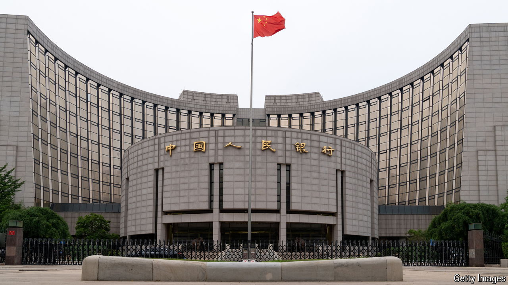

###### Next-door vigilante

# What is behind China’s perplexing bond-market intervention? 

##### The central bank seems to think the government’s debt is too popular 

 

> Aug 14th 2024 

Many governments live in fear of bond-market “vigilantes”, investors who punish errant policies by aggressively selling the sovereign’s debt, driving down its price and thereby pushing up its yield. Financial regulators also worry about bond-market malfunctions, such as unsettled trades, when one party to a transaction fails to honour its promises. These mishaps can send ripples of anxiety through an entire . 

