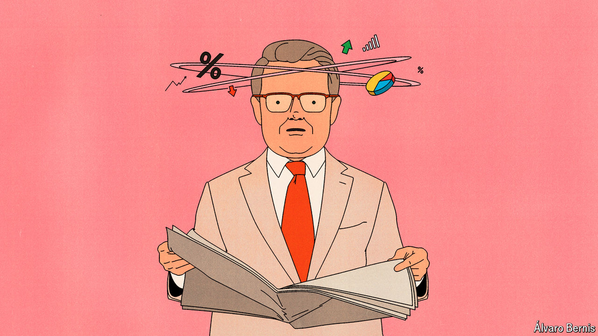

###### Free exchange

# Why companies get inflation wrong 

##### Bosses should pay less attention to the media 

 

> Aug 15th 2024 

Over the past year-and-a-half inflation has fallen sharply across the rich world. Although some central banks have now begun to cut interest rates, few are yet ready to pat themselves on the back for a job well done. In many countries the core rate of inflation, excluding volatile energy and food prices, remains uncomfortably high—at 3.2% in America and 2.9% across the euro zone—even as underlying economies show signs of slowing and financial markets become increasingly jittery. The marathon task of returning price growth to more normal levels is not quite finished. And the last mile, as so often, is proving the toughest.

