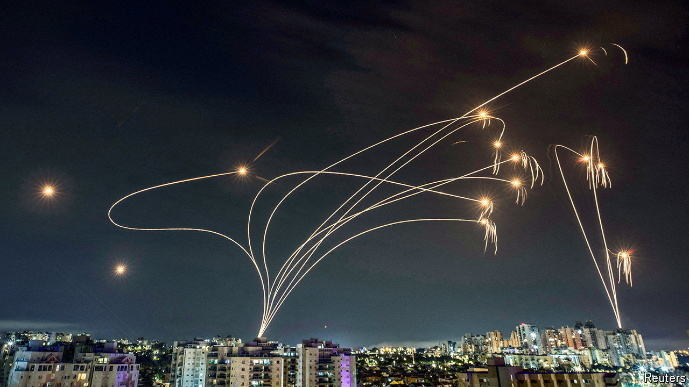

###### Star wars: a new hope

# Can Donald Trump’s Iron Dome plan keep America safe? 

##### In a dangerous world, cutting-edge missile defence is all the rage 

 

> Aug 11th 2024 

JUST BEFORE Donald Trump became the Republican nominee for president, the party published its : “Prevent world war three, restore peace in Europe and in the Middle East, and build a great  missile-defence shield over our entire country”. The last of those promises has become a staple of the Trump campaign. In his speech accepting the nomination, he promised that an American missile shield will ensure “no enemy can strike our homeland”, adding that it would be “built entirely in the USA”. 

