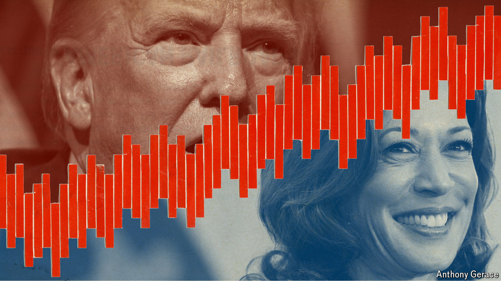

###### A coin toss for the White House

# Our forecast puts Kamala Harris and Donald Trump neck and neck 

##### We relaunch our presidential-election model for a transformed race 

 

> Aug 15th 2024 

THE MOOD among Democrats, as they prepare to gather for their national convention in Chicago next week, is ebullient. Kamalamentum has transformed the presidential contest. Meanwhile, the Republicans are finding it hard to adjust to the new dynamics: the glitch that delayed the start of Donald Trump’s conversation with Elon Musk, carried live on X on August 12th, was emblematic of a campaign that is no longer going to plan. Yet if there is one lesson from this wild election year, it is that things can change with remarkable speed. 

