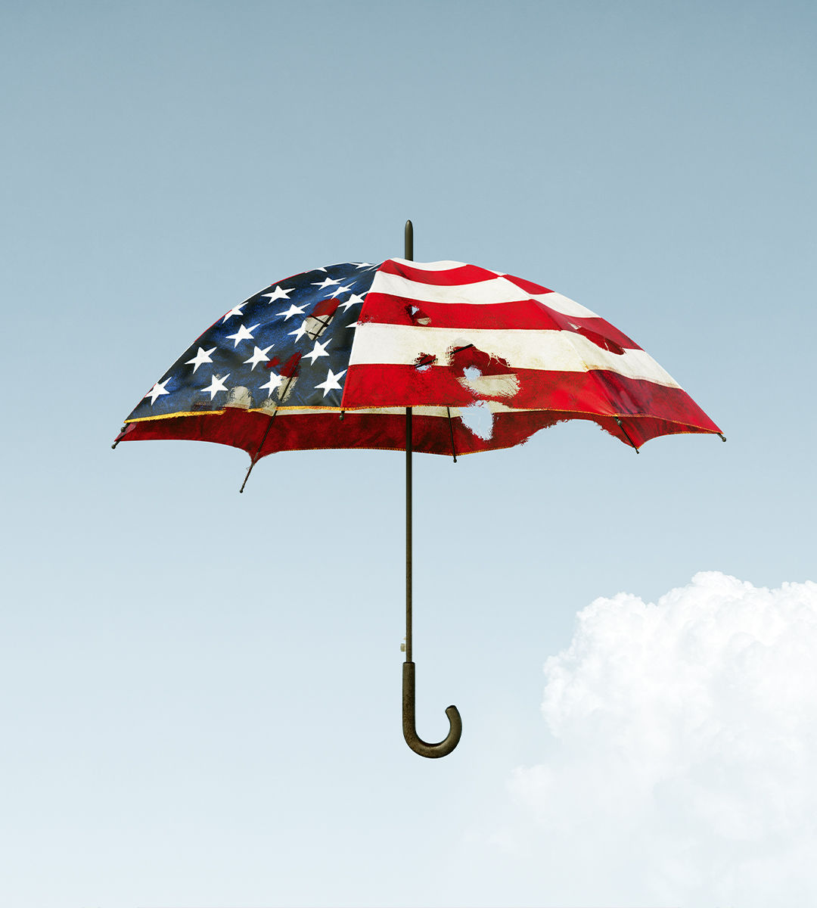

###### The new nuclear threat

# Reluctantly, America eyes building more nuclear weapons 

##### The superpower faces more adversaries, new technologies and less-confident allies 

 

> Aug 15th 2024 

The nuclear de-escalation that followed the cold war is over, the Pentagon warned this month. In its place is a new rivalry among nuclear and almost-nuclear powers, some of them paranoid. It is more complex and less predictable than the old, bipolar contest between America and the Soviet Union. That makes it more dangerous. 

