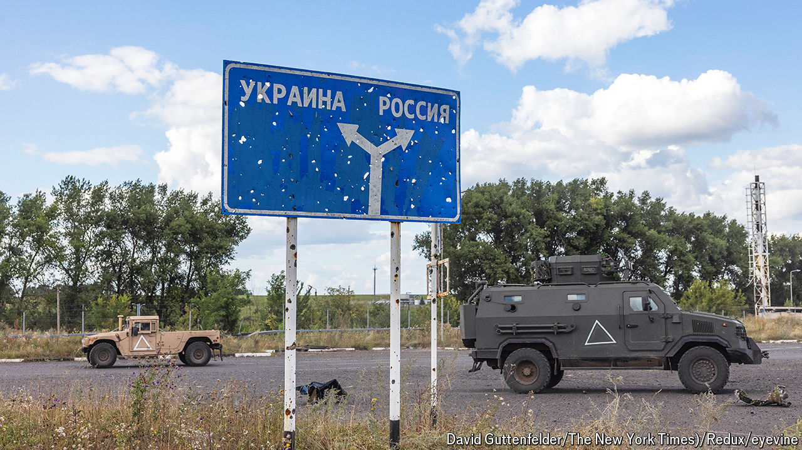

###### Fighting back

# The rights, wrongs and risks of Ukraine’s Kursk incursion 

##### Ukrainian forces should be careful not to overreach 

 

> Aug 14th 2024 

For the first time since the second world war, . On the previous occasion the Red Army’s Ukrainian troops helped beat back the Nazi assault in Russia’s Kursk province. Now it is Ukrainians who are  over the same ground. , which began on August 6th, is bold and daring, and could change the narrative of the war. It is also a gamble which could go badly wrong.

