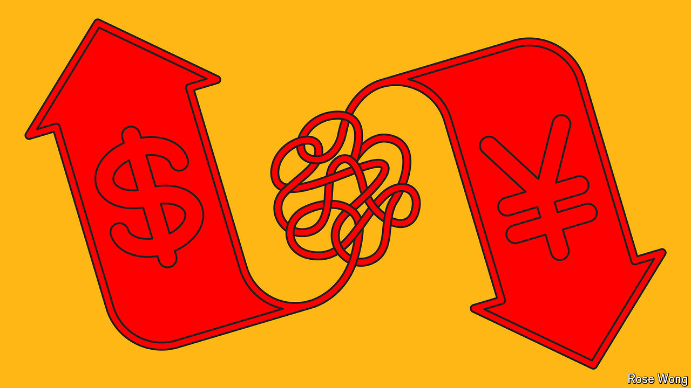

###### Billions or trillions?

# Time to shine a light on the shadowy carry trade 

##### Transparency will help to avoid financial blow-ups 

 

> Aug 15th 2024 

Soon after markets tumble, the search for the culprits begins.  over the past two weeks has put a dent in stock prices globally, while safe government bonds have rallied. Concerns about the health of America’s economy and its expensive tech stocks are part of the explanation for the surge in volatility. Analysts and investors have identified another culprit behind the tumult: the reversal of opaque , particularly in the Japanese yen. 

