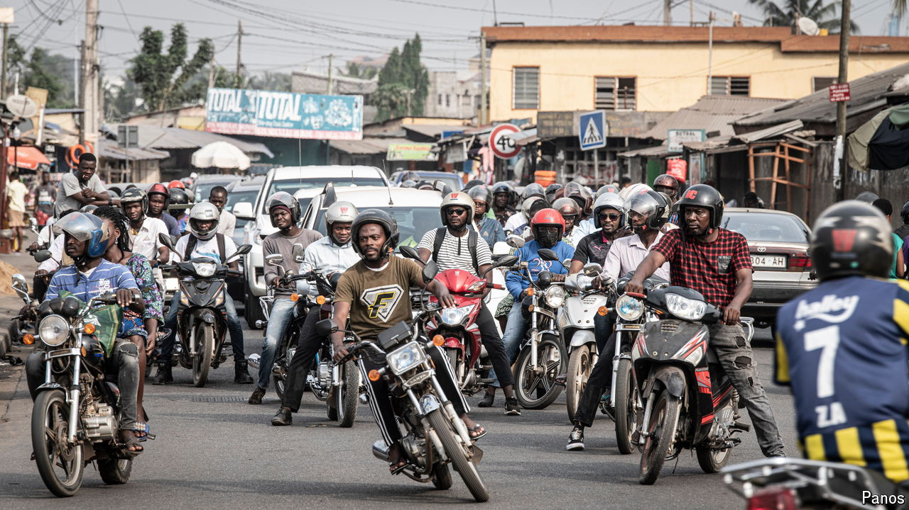

###### Vroom vroom!

# Cheap Asian motorcycles are transforming African cities 

##### The $1,000 boda boda carries a big economic punch 

 

> Aug 15th 2024 

At the Haojue showroom in Kigali, Rwanda’s capital, Gaston Kamo dusts the latest model’s ruby-red fuel tank. “With motorcycles you can go everywhere, even muddy roads,” says the salesman for the Chinese manufacturer. The gleaming 125cc bike costs 1.25m Rwandan francs (around $1,000). “Much less than a car,” adds Mr Kamo, gently angling for his cut. 

