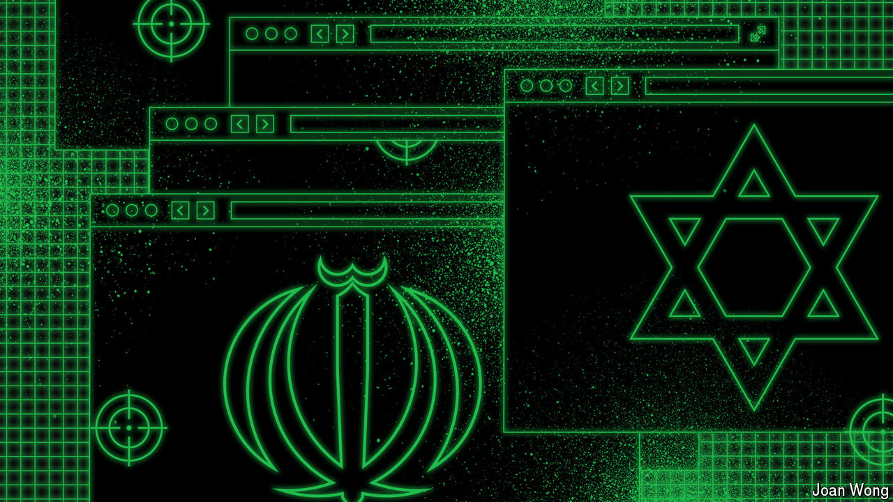

###### Byte the bullet

# Iran’s electronic confrontation with Israel 

##### The two adversaries are engaged in an intense cyber struggle, with Israel still a click ahead 

 

> Aug 15th 2024 

ZIV HOSPITAL is nestled at the bottom of Safed, the highest city in Israel, not far from the border with Syria and Lebanon. In November the hospital acknowledged that hackers had penetrated its computer systems. An Iran-backed hacking group would later claim to have gained access to 500 gigabytes of patient data, including 100,000 medical records linked to Israeli soldiers. That is hardly unusual. Hackers regularly target and breach hospitals, usually to extort ransoms. 

