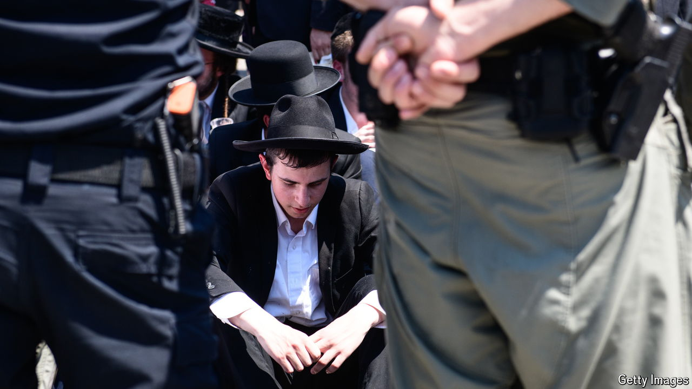

###### Conscription

# Israel’s ultra-Orthodox still won’t fight, invoking scripture 

##### An age-old argument is making Binyamin Netanhayu face an enduring dilemma 

 

> Aug 15th 2024 

The armed forces bent over backwards on August 4th to welcome a new wave of recruits. Induction centres in Jerusalem and Tel Hashomer near Tel Aviv were adapted to soothe the religious sensitivities of prospective draftees. No female soldiers were in sight, so as not to offend the young men who had grown up in an environment strictly segregated by sex.

