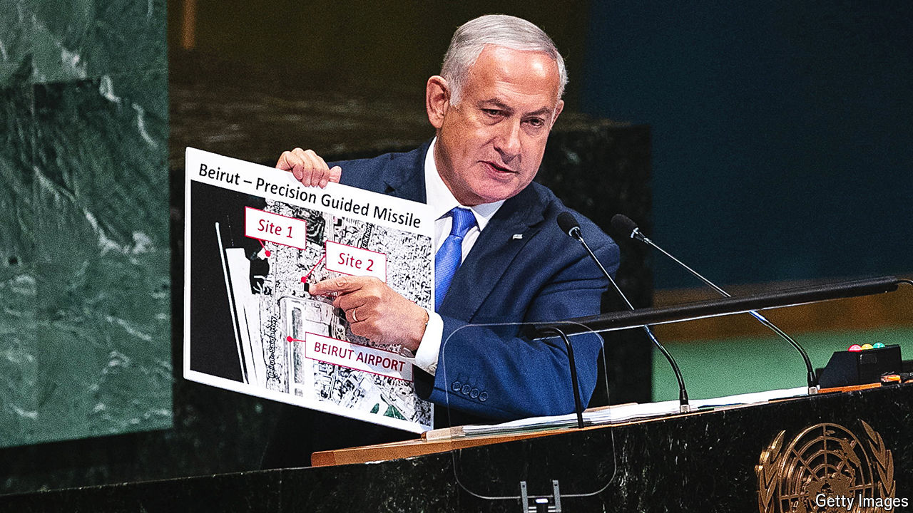

###### Putting in a time of war

# The bunkers on Beirut’s golf course are in the crosshairs 

##### Still, hazards off the fairway are no excuse for slow play 

 

> Aug 15th 2024 

There are a handful of gaps on the honours board at the Golf Club of Lebanon in Beirut, the capital. One is for 1982, when Israel’s army bulldozed the fairways during its siege of Beirut. The other blank entries hark back to the civil war. This is Lebanon’s only golf course. With the war drums banging, it once again finds itself the centre of attention.

