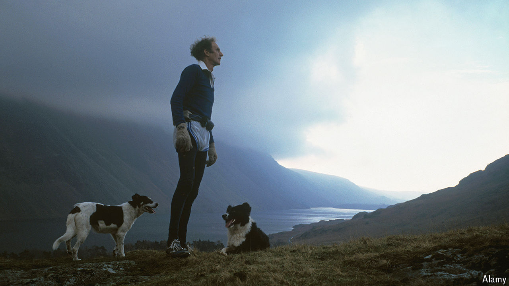

###### Running the peaks

# Joss Naylor never let any mountain defeat him 

##### The sheep-farmer and champion fell-runner died on June 28th, aged 88 

 

> Aug 14th 2024 

There wasn’t much to the Lake District village of Wasdale Head. Seen from a helicopter or a drone, it was just a few stone cottages and one hotel. On every side loomed up mountains: Kirk Fell, Great Gable and the huge bulk of Scafell Pike, 3,209 feet or 978 metres, the highest mountain in England. And if you kept on looking until relatively recently you might well see a lone figure, tiny as an ant, running down one of them. He had on a T-shirt and shorts, both flapping on his thin frame, and ran with that distinctive gait he had, not poker-legged but bent-kneed and leaning forward a bit, into the stride. A sheep dog usually bounded alongside. At the bottom he’d pause at the fast-flowing beck, cast off shoes and socks and give his legs a proper cooling scrub. 

