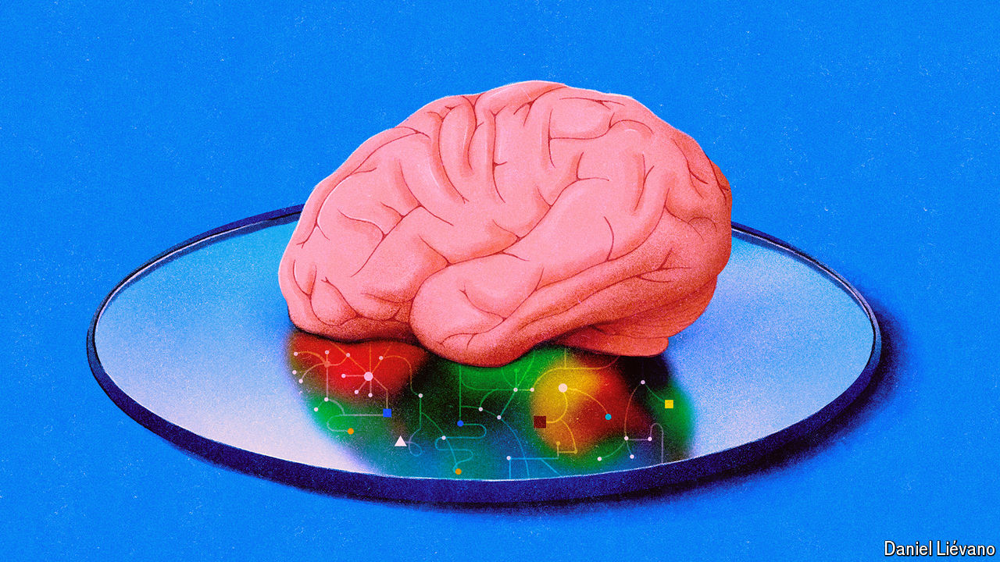

###### Backprop in the brain

# AI scientists are producing a host of new theories of how our brains learn 

##### The challenge for neuroscientists is how to test them 

 

> Aug 14th 2024 

Five DECADES of research into artificial neural networks have earned Geoffrey Hinton the moniker of the Godfather of . Work by his group at the University of Toronto laid the foundations for today’s , including ChatGPT and LaMDA. These can write coherent (if uninspiring) prose, diagnose illnesses from medical scans and navigate self-driving cars. But for Dr Hinton, creating better models was never the end goal. His hope was that by developing artificial neural networks that could learn to solve complex problems, light might be shed on how the brain’s neural networks do the same. 

